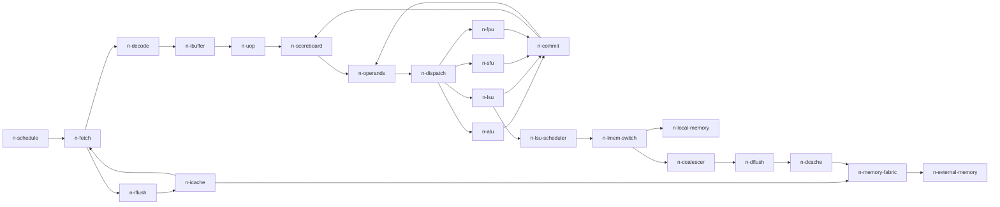

# Timing IR 架构基线

## T12 当前执行架构

实际生产链为 Kernel/Runner → MultiRunner → scheduled Core + memsys.System。
System 组合 I/D-cache、split/coalescer、word adapters、原 owner LMEM 和共享外部后端，
以真实接受和返回驱动 Core；load 不绕过缓存，store dirty bytes 通过明确写回可见。
CTA 回收与状态共用 observeCTA，保留每个 residency 的全部传输/效果尾部，
不因有效或 dirty line 阻止执行完成。使用与抽象边界见 [T12 记录](t12-delivery.md)。
下文 T9–T11 小节为历史背景，固定延迟及旧单活动 Runner 描述已被本节取代。

## T11 orchestration 基础

`runner.Kernel` → `MultiRunner` → scheduled timing Core 是实际推进链；`emu/device` 仅复用 LaunchState/GridWalker 值语义。CTA metadata/LMEM 由独立 ResidencyMemory 持有，架构效果留在 WarpState，流水线与注册控制留在 model，异步字节服务与效果收据分别跟踪。普通回收只检查相关 CTA 的所有成员和 Barrier 状态；Kernel 完成再汇总生成、驻留、票据和释放状态。

完整 API、停止条件审计与 T12 生命周期测试映射见 [kernel-usage.md](kernel-usage.md)。RTL 证据和周期控制见 [task11-cycle-control.md](task11-cycle-control.md)，launch/reentry 见 [task11-kernel.md](task11-kernel.md)，同步/身份见 [task11-kernel-sync.md](task11-kernel-sync.md)。以下章节保留静态 IR 的建模和维护依据，不表示当前仍仅有静态模型。

本阶段在完整阅读功能契约后，按 README → 配置 TOML → 生成头 → package 派生参数 → 实际实例/端口 → 缓冲封装的顺序核对。输入均来自仓库；未修改或重新生成冻结 RTL，未使用外部 reference。`ir.yaml` 的 `sources` 给出可定位路径及模块/信号/参数，证据引用采用 `source-id::symbol`。这里的节点是静态传输/资源边界，不预定未来 Go 对象。

## 表达与维护

`PROVISIONAL`：本版 schema 是特定冻结数据集的查询格式，不是可执行 IR 语言。YAML 的 `config`、`nodes`、`resources`、`ports`、`channels`、`boundaries`、`rules`、`unknowns` 分别登记配置、组件、占用实体、端口、连接、物理寄存器/缓冲、规则与缺口；`timing_measurements` 登记带起止事件、适用条件和单位的定量项，`measurement_convention` 统一边沿计量约定。ID 在各集合内唯一；跨集合通过具名字段引用，删除/改名必须同步所有引用。port 的 `node`、channel 的 `from/to`、boundary 的 `node`、rule 的 `nodes` 都是引用。一个节点可有多个端口和多个物理边界，不能把节点数当周期数。

YAML 每个事实条目的 `status` 和 `evidence` 覆盖该条的字段；局部未知以独立 `unknowns` 条目及 `unknown_ref` 表达，`null` 表示未定，绝不表示零。`FROZEN` 只针对 `cfg-baseline` 条件下的源级事实；`PROVISIONAL` 是设计候选；`UNRESOLVED` 是明确缺口。`RESOLVED` 仅保留原问题、决定、证据、验证、闭合 Task 的审计含义，不自动升级时序事实，见 `audit-functional`，不得将功能已闭合项直接标成硬件时序闭合。

数值单位见 YAML `units`；容量以指定 scope 的 entries 计，byte/bit 与 lane 数分开。`rtl_parameters` 是实例实参，不保证等于可用容量或完整延迟。`OUT_BUF` 是编码，须经 `b-encoding` 映射；`SIZE=0` 是直通，`SIZE=2, OUT_REG=0` 仍通过 `VX_stream_buffer` 的注册 valid/data 路径；OUT_REG 改变数据 mux 与寄存器位置，不是“关闭所有寄存器”，也不是两周期延迟。`latency_cycles` 只在起止边界明确时使用；cache 的 LATENCY 仅是 bank pipeline 参数。端口上的宽度是单个传输 payload 的数据部分，未包含 tag/control；`count` 为物理并行端口数，不能自动解释为指令吞吐率。

结构化参数、buffer 编码、完整规则只维护在 YAML。Markdown 只引用 ID、解释后果与软件职责；功能方程继续由 `isa` 和功能契约维护。本阶段不将 YAML 当作新的 opcode manifest，不复制功能参数表。

## 冻结条件与可达路径

`cfg-baseline` 取自输入包声明的数据集，不声称获得了某次外部 RTL elaboration 的编译命令。生成头仍允许 `-D` 覆盖；外部工具链轴须与配置轴分开。`cfg-fpu-conditional` 登记无外部定义时的 STD 路径及条件分支，实际构建后端为 `u-build`。D、TCU 等关闭路径即使保留枚举或内部参数，也不进入节点图。尤其 SFU 的 PE 数由启用条件求值；Core 的 LSU client 数依据 `LSU_SCHED_NUM_CLIENTS`，不采用其旁边过时的“两 clients”注释。

主链使用 YAML ID：

图为概览，省略反向响应、adapter、控制反馈和内部 PE；完整端口与连接以 YAML 为准。

`r-schedule`：取指选择和 issue 选择分离。scheduler 在自己的输出缓冲接受时记账，fetch 到请求缓冲、cache 接受请求、decode 接受返回是不同事件。`b-schedule`、`b-fetch-request`、`b-decode` 明确这些边界。`n-fetch` 的 tag store 按 warp 保存 PC/mask/CTA，因此不能随意允许同 warp 并发覆盖 fetch context。`r-decode-feedback` 的 unlock 是注册反馈；控制指令仍由执行反馈解除 stall。

`n-ibuffer` 后有真实启用的 `n-uop`。packed load 经 `r-packed` 展开，多次 byte-select 写回和一条功能指令原子完成并非同一粒度。`n-scoreboard` 前 staging、输出 skid 与 FU credit 都是独立占用；`r-scoreboard` 明确 WB release 和新 reserve 的组合顺序，不能把 operands_ready 的寄存器省掉，宣称同周期任意旁路。

`n-operands` 按寄存器低位选 bank，真实 read pipeline 与冲突重试不能用固定的“读三个源一次完成”替代。`b-opc-read` 登记两个 pipe register 与同步 RAM 输出，`b-opc-out` 单独登记结果 skid。FU dispatch 队列按执行类分开，信用涵盖尚未抵达队列的 operand collection 工作，不能再把同一信用当第二个实体队列容量。

`n-alu` 内 INT 与 MULDIV 共享 PE response merge，`n-sfu` 内 WCTL 与 CSR 共享 merge。lane dispatch/gather 实参依单元而异，不能因冻结全宽就全部消去。`b-alu-*`、`b-lsu-*`、`b-sfu-*`、`b-fpu-*` 登记已核对的边界；已确认的局部执行延迟与接收间隔见 `timing_measurements` 和 [rules.md](rules.md)，剩余条件路径和全路径最短周期仍归 `u-execution`。

`r-commit`：硬件 commit 是执行结果汇合与写回，不是 ROB 或原子架构 bundle 提交。WB 无 ready，携带 wb、eop 和 bytesel；寄存器释放、scheduler pending 更新和指令效果可见性分别有端口。branch 在 ALU result 被接受后另行注册，WCTL 在 execute fire/eop 后注册；FCSR flags 在 FPU response fire 后另行注册。它们不都等待 `n-commit`，也不能在一个统一“退休时刻”无条件应用。

## 访存与控制边界

`n-lsu-scheduler` 实际实例在 Core。其 request queue、outstanding load tag pool 与 `n-coalescer` 的槽分开登记；MEM_QUEUE_SIZE 的实参存在不证明当前关闭 coalescing 的 scheduler 内部有另一条同深度队列。`r-lsu-drain` 明确 empty 包含 request queue 与 outstanding load 索引池的源方程；LSU 排空、mem unit store tail、D-cache dirty state、外部 memory 可见性是不同条件。

`n-lmem-switch` 可拆分同一请求的 lane mask；local 路径含 adapter 和 banked local memory，global 路径在当前 word size 下实际启用 coalescer，再经 adapter/flush 到 D-cache。`n-iflush` 同样实际存在，VM 关闭只移除 MMU，不移除 flush。`r-flush` 登记 D/I flush 次序。L1 位于 Socket，`n-memory-fabric` 保留端口零的 I/D 仲裁、其他 D 端口及 L2/L3 passthrough wrapper。关闭 cache 层不自动等于移除旁路逻辑；本次进一步展开 `DIRECT_PASSTHRU` 后，冻结 L2/L3 的等宽、等端口条件确实将内部输出 buffer 置零，见 `r-memory-fabric`。

cache 容量和 bank pipeline knob 可确认，但本阶段不建立 hit/miss、替换、MSHR 分配或 DRAM 服务算法。自动队列大小及 direct bypass 已由 [rules.md](rules.md) 的规则补全；`u-memory` 继续保留外部服务及复杂 miss/flush 路径；平台标称频率/带宽不能作为每个请求的完成时间。

scheduler 内的 CTA dispatch、split/join/IPDOM、barrier 以独立控制节点登记。`ch-*-feedback`、`ch-sched-csr-*` 和 `ch-*-pending` 表达主数据链外的联系。功能 `U-MEM-01/U-FAULT-01/U-ABI-01` 等缺口继续保留；本静态图不能闭合竞态可见性、fault priority 或 host completion。

## 软件职责与功能复用方向

以下全部为 `PROVISIONAL`，没有新增 Go API 或第二份语义：

| 职责 | 初步边界与状态归属 | 复用评估 |
| --- | --- | --- |
| 周期推进 | 持有时间和事件阶段；先计算稳定组合结果，再按明确 edge 更新组件状态 | 可评估离线 Akita；不照搬 `Core.Step/Run` 次序 |
| 流水组件 | 各自拥有 queue occupancy、valid payload、tag、bank reservation；仅经端口转交 | 新建 timing transient state；功能 WarpState 不持这些字段 |
| 调度控制 | 持有 hazard/credit/warp eligibility 与 pending 记账；消费具名反馈 | `emu/core/core.go` 的 round-robin 和原子 Warp.Step 需重新组织，不直接复用为周期 scheduler |
| 语义衔接 | 按真实 operand/read context 调用现有 decode/evaluator；以稳定指令/微操作身份保存 detached effects | `isa.Decode`、四类 Evaluate 和 CompleteMemory/CompletePackedLoad 可复用；不复制 ALU/FP/SIMT 方程 |
| 可见性与 owner | 单一架构状态 owner 接受计划好的寄存器/CSR/PC/控制效果；区分 operand snapshot、执行结果和已可见 state | `emu/state/view.go`/`integration.go` 可借鉴最小 view；`apply.go` 的全 before-image stale gate 与整指令原子 replacement 不能直接用于重叠流水，需要适配 |
| Memory/CTA/Barrier | byte owner 与请求时序分开；tag/response 队列不建立第二个功能 backing owner；T12 cache 可持有合法 valid/dirty 数据副本，见 memory-contract.md | `emu/warp/warp.go` 同步 Read/Write/WriteBatch 需异步适配；保留 caller backing identity、CTA scope 与 barrier key 原则。`emu/device/kernel.go` 的原子 admission/run 不定义硬件调度周期 |

`u-visibility` 是后续实现前的关键接口决策：不能提前执行 store，也不能在 WB 再次执行已经应用的副作用；不能延迟整个旧 WarpState replacement 覆盖其他已完成指令。功能严格 illegal decoder 与 RTL 宽松 default 的差异继续沿用功能契约，不在时序层补定 fault mapping。对 packed load、跨 owner control、FFLAGS 等必须分别定义功能 effect 身份与可见事件，再选择最小适配方案。

## 本阶段验证与后续闭合

T9 增量实现见 [implementation.md](implementation.md)。`r-software-edge` 已有缓冲级 Evaluate/CommitEdge 实证，`r-software-clock` 记录 Akita 公共边沿驱动；上文 T8 软件职责候选仍不能视为已全部实现。缓冲容量与注册语义沿用原有稳定 ID，不改变任何功能 owner。

交付检查包括 YAML 安全解析、各类 ID 唯一、端口/节点/规则/来源引用有效、来源路径存在，以及冻结的文件非空和 `git diff --check`。这些是静态一致性验证，不是 RTL 仿真或周期准确性证明。

本阶段提供可开始组件分解的结构基线。[rules.md](rules.md) 已补充这些局部容量/延迟/接收间隔与事件规则；剩余条件路径仍见 `u-execution`、`u-memory`、`u-feedback`，[integration.md](integration.md) 已给出 `u-visibility` 的适配候选，具体协议仍须后续实现验证。`u-build` 需要实际构建定义才能选择后端；未知项不得以零延迟或任选默认后端绕过。

T9 第三轮的 `Frontend` 已实现上述前端的瞬态连接；`ALU`、`SFU` 和显式 `STDFPU` 通过各自局部 result buffer/merge 组合，见 `r-software-composition`。这些复合组件只通过子组件公开端口和 proposal 交互。Frontend→ALU→Commit 的 token 测试已验证公共边沿和遍历顺序独立性；后续增量已补齐 LSU、程序驱动、功能交付与对象驻留观测，见文末当前运行说明。

第四轮增量补齐 `LSU` 和 `Core`，见 `r-software-lsu`/`r-software-composition`。LSU scheduler 的 vector port 是外部服务边界；内部 request4/tag8 与 load/store result/merge/gather 均已建模。`RunTokens` 用 Akita 驱动全部路径，`ResourceState/CoreReport` 提供每边沿旧态快照和握手通知。独立运行示例见 README；该诊断入口不执行功能 effects，不能替代后续功能适配验收。

### Task9 程序运行器增量

`timing/runner` 复用 Core/effects 和原 state/memory owner，以单活动指令排空策略从 canonical PC 自动取指；取指与数据服务均采用显式正延迟，不代表 cache 时间。Akita Run 支持预算续跑，Flush 清除在途服务并增加 epoch，不回滚已可见效果。条件见 `r-software-program-runner`。

本地入口：在仓库根目录 `source env/env.sh` 后运行 `go run ./cmd/timing-run`；`-trace` 输出逐周期 JSON，`-program file.bin` 从 0x100 加载 raw little-endian RV32 镜像。默认四 lane、x1=64+8*lane，内建示例验证依赖 ADDI/MUL/DIV、store/load、分支跳过指令与 TMC 结束。显式 STD、1ps 模型时基、fetch=3/memory=19 cycles；可用对应 flags 修改服务延迟。命令行预算耗尽返回非零；库保留进度可续跑。多目标 spawn residency 仍需 effects.BindSpawn，当前程序入口明确拒绝，不实现多 Warp scheduler。

观测包含旧边沿 CoreReport、提交后的 ResourcesAfter/Residents、Services 及 Events。按 ID/epoch/warp/uop/mask 对应资源生成 enter/stay/advance/leave，读、执行、WB/反馈另有事件；Flush 取消事件保留旧 epoch。位置与 Remaining 是本地资源状态，不推定外部 cache 时间。

### Task9 对象驻留观测与验证

每个资源通过 `Residents()` 返回 detached value，含 Token、位置、局部 Remaining 与 readiness 原因；runner 不访问组件队列。CoreReport.Resources 是旧边沿，ResourcesAfter 是本次统一提交后状态。Events 的 enter/leave 对应本周期提交的转移，stay/advance 表示资源仍持有该对象；tag/context alias 保持独立资源身份，不能累加为指令数量。FIFO 中的 queue-order、输出 awaiting-transfer、执行 execution-latency、tag response-coverage 与外部 backpressure/control-drain 明确区分；这些原因不宣称解析全部 RTL 仲裁信号。Services 列出原 byte owner 服务队列及显式 due cycle。

程序 trace 测试验证驻留记录闭合、除法 33 周期占用、packed 请求背压后按逐 uop WAW 恢复且每 uop 只 WB 一次（独立 LSU 组件另测队列容量）；增加 memory 服务延迟或请求背压会延长完整运行，功能结果不变。重复运行记录确定；快照修改不会改变组件 owner。基础注册边界与满队列同时接收/释放继续由 timing/model 门禁覆盖。

### Task10 timing-contract

新增 [四 Warp 周期契约](multiwarp-contract.md) 与 `ir.yaml/cycle_contracts`，将旧态采样、next-state、具名 consumer、边沿差和同时事件明确分开。事实带冻结 RTL 逐字锚点，软件上下文/选择性 flush 接口保持 PROVISIONAL，控制碰撞通过 `u-feedback` 保持 UNRESOLVED。Scoreboard reserve 明确为 staging 输出握手，packed 的释放按单 uop eop 而非宏指令结束；pending 另按 Scoreboard 输出握手注册记账。本轮没有实现并发 Scheduler 或改变原 canonical owner。

### Task10 multiwarp-scheduling

`model.NewScheduledCore(backend, [4]WarpContext)` 从调用者显式前端上下文启动四 Warp 取指，复用四套 IBuffer/Sequencer、共享 Scoreboard/Collector/Dispatch 与原执行组件；`Core.Evaluate` 将实际 Commit writeback 接回 Scoreboard。所有注册更新由同一 CommitEdge 安装。取指上下文与 canonical owner 分离，单指令功能 runner 保留显式 token admission。实施、具体周期测试与剩余控制/功能边界见 [实施记录](task10-progress.md)。

### Task10 当前完整运行接口

`runner.NewMulti` 驱动四个显式功能 owner，`effects.Concurrent` 按完整身份管理
在途 receipt 并统一采样旧边沿；`EffectStream` 即时交付，迟到普通完成不回退
较新控制上下文。已接入 branch/SIMT/WSYNC、显式 Barrier Release、绑定 WSPAWN
原子事务、取消/Restart/Flush 及逐 Warp/资源 trace。上述各阶段说明保留历史
验收背景；当前能力、边沿、软件限制与 AC-017 至 AC-023 映射以
[最终控制实施记录](control-observability-progress.md) 为准。单活动策略仅属于
保留的旧 Runner 诊断 API；Task10 普通指令不等待整 Core Idle。

T12 里程碑 01 的结构化存储契约见 [memory-contract.md](memory-contract.md) 和 `ir.yaml:memory_contracts`。它扩充静态证据与接口，不宣称后续 cache/LMEM 运行时已接入。

### 设备存储续用（runtime 修复，第 1 Worker）

Kernel.NextLaunch 在健康执行完成且完整排空后转移同一 memsys/Clock 的所有权，
不重置 Cache；新执行上下文拥有递增 launch identity。旧 Kernel 不再能推进，
Status 保留交接快照。Cycle 是设备连续周期，StartCycle/LaunchCycles 明确本次
launch 的计数起点；runtime 分开记录执行与真实 D/I flush 的差值。
详见 [设备生命周期交接](../docs/runtime/device-lifecycle-handoff.md)。

### 逐 Warp 驻留（runtime 修复，第 2 Worker）

生产 Kernel 以独立 CTA/LMEM reservation、注册 Warp selection/fire 和退休流水推进；
不再一次绑定完整 CTA，也不等待所有旧成员结束才允许局部复用。ResidencyMemory
仍是 metadata/LMEM 单一 owner，CTA Size 保持逻辑完整大小，当前 Members 可为空或
为部分绑定。物理 Warp generation 与 CTA slot generation 分开，完整 transport 和
barrier 尾部继续保护复用。接口、RTL 边沿和 trace 事件定义见
[增量 Warp 驻留交接](../docs/runtime/incremental-warp-handoff.md)。

## Runtime 身份与硬件计数（device-and-warp-lifecycle，第 3 Worker）

`RESOLVED`：Kernel 的边沿记录以 DeviceID/LaunchID、显式 WarpBinding 和
Token.ID/Epoch/Uop 关联逻辑 CTA/rank、物理 slot/generation；存储 fragment trace
连接 SIMD parent、coalescer Batch、adapter wire transaction 和 Cache 接受，
保留 port-0 注册缓冲相位。绑定来自真实 dispatch 与唯一 residency owner。

`RESOLVED`：原生 MPM 按 VX_dcr_data tag 编码导出已有 scheduler 44 位 Cycle/Instret。
NextLaunch 转移计数与 busy 寄存器；显式 flush 在真实空闲边沿推进 busy 尾部。
Instret 是 committed Warp/EOP 通知，不是宏收据或 lane 计数。runtime 保存终态
硬件快照并在审计之后发布，未知统计明确 unavailable，不以有效零值代替。

字段、RTL 依据、复验命令及未验证的外部边界见
[身份与计数交接](../docs/runtime/identity-performance-handoff.md)。
本条不关闭首次 host DCR 时间线、外部 native benchmark 或 RTLSIM 等价问题，
也不替代 closure Worker 的全仓与里程碑验收。

### 生命周期跨层收尾

收尾核对补齐了 `VX_scheduler.busy_buf || cta_dispatcher_busy` 的 Cycle 计数
接线：CoreInputs.DispatchBusy 来自真实 CTA 接纳及边沿前 DISPATCH 状态，
不人为增加延迟或修改 wall-clock。注册 busy 尾部、累计 44 位计数及 EOP/宏
单位保持独立。跨 launch 的提前复用、store/取消尾部、barrier/LMEM/TLS、
fragment 身份和审计/MPM 组合证据见
[生命周期收尾验收](../docs/runtime/lifecycle-integration-closure.md)。
